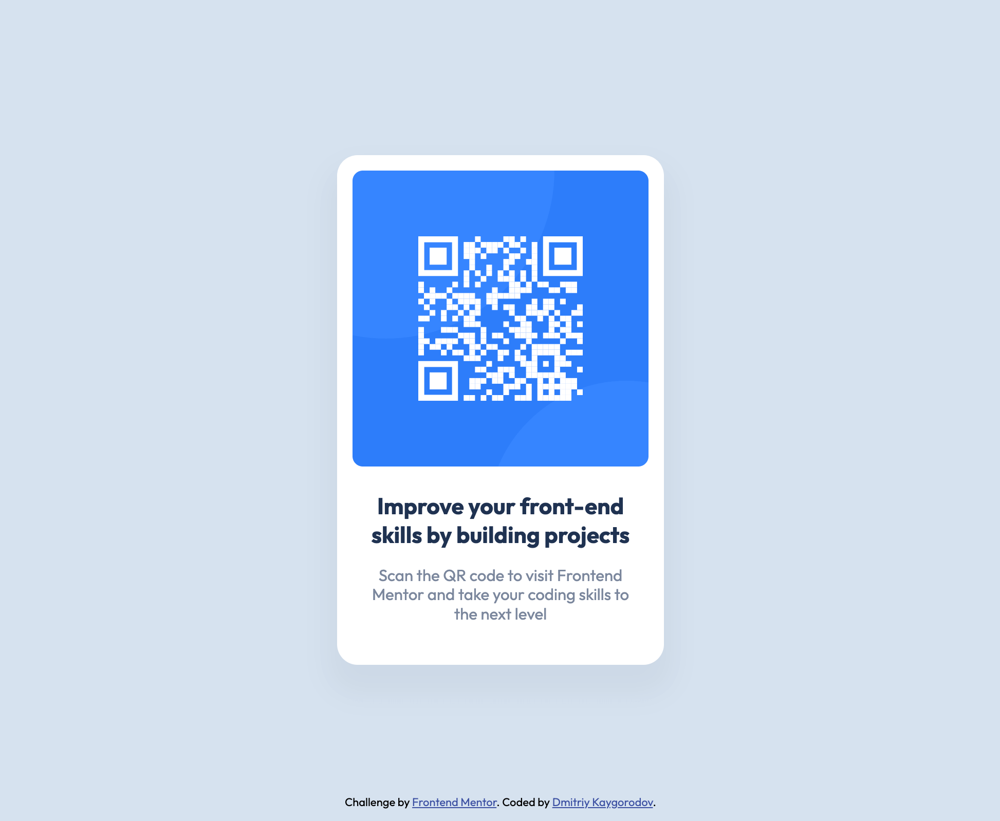

# Frontend Mentor - QR code component solution

This is a solution to the [QR code component challenge on Frontend Mentor](https://www.frontendmentor.io/challenges/qr-code-component-iux_sIO_H). Frontend Mentor challenges help you improve your coding skills by building realistic projects.

## Table of contents

- [Overview](#overview)
  - [Screenshot](#screenshot)
  - [Links](#links)
- [My process](#my-process)
  - [Built with](#built-with)
  - [What I learned](#what-i-learned)
  - [Continued development](#continued-development)
  - [Useful resources](#useful-resources)
- [Author](#author)

## Overview

### Screenshot

### Links

- Solution URL: [https://github.com/DBKai/qr-code-component](https://github.com/DBKai/qr-code-component)
- Live Site URL: [https://dbkai.github.io/qr-code-component/](https://dbkai.github.io/qr-code-component)
## My process

### Built with

- Semantic HTML5 markup
- CSS custom properties
- Flexbox
- Mobile-first workflow
- BEM (Nested)
- Pixel perfect

### What I learned

- Flexbox
- Semantic tags
- BEM (Nested)
- Positioning
- Fonts

### Continued development

I want to continue focusing on flexbox and grid layout in future projects.

### Useful resources

- [TinyPNG](https://tinypng.com/) - This helped me for compress images.

## Author

- Website - [Dmitriy Kaygorodov](https://dkay.ru)
- Frontend Mentor - [@yourusername](https://www.frontendmentor.io/profile/DBKai)
